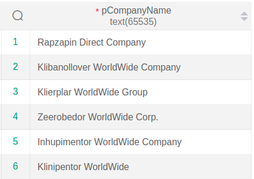
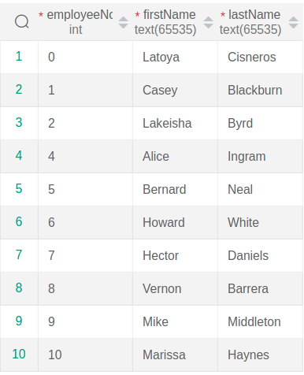
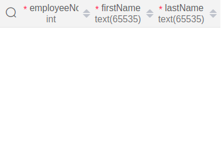

# Database Project

## Quries


``` sql
    SELECT pCompanyName
    FROM prevcompany
    WHERE prevcompanyno IN (
        SELECT prevcompanyno 
        FROM workhistory
        WHERE employeeno IN (
            SELECT employeeno 
            FROM employee
            WHERE departmentno = 6)
        );
```



``` sql
    SELECT employeeNo , firstName, lastName 
    FROM employee 
    WHERE salary > SOME ( 
        SELECT salary 
        FROM employee 
        WHERE sex = 1
    );
```



``` sql
    SELECT employeeNo , firstName, lastName 
    FROM employee 
    WHERE salary > ALL ( 
        SELECT salary 
        FROM employee 
        WHERE sex = 1
    );
```



``` sql
    SELECT employeeNo, firstName, lastName 
    FROM employee 
    WHERE employeeNo IN ( 
        SELECT employeeNo 
        FROM workhistory, grade 
        WHERE workhistory.prevGrade = grade.gradeNo AND grade.gradeSalary > ( 
            SELECT AVG(gradeSalary) 
            FROM grade 
            ) 
        );
```


``` sql
    SELECT employeeNo, pCompanyName
    FROM ( employee INNER JOIN workhistory USING(employeeNo) ) INNER JOIN prevcompany USING(prevCompanyNo)
    WHERE departmentNo = 6;
```


``` sql
    SELECT employeeNo , firstName, lastName 
    FROM employee e1
    WHERE e1.sex=0 AND e1.salary > SOME ( 
        SELECT salary 
        FROM employee e2
        WHERE e2.sex = 1
    );
```


``` sql
    with emp_work_prev(employeeNo, firstName, lastName, pCompanyName) AS (
        SELECT employeeNo, firstName, lastName, pCompanyName
        FROM employee INNER JOIN (workhistory INNER JOIN prevcompany USING(prevCompanyNo)) USING(employeeNo)
    )
    SELECT employeeNo, firstName, lastName
    FROM emp_work_prev e1
    WHERE e1.pCompanyName='Rapzapin Direct Company' AND EXISTS (
        SELECT *
        FROM emp_work_prev e2
        WHERE e1.employeeNo = e2.employeeNo AND e2.pCompanyName='Klibanollover WorldWide Company');


```


``` sql
    SELECT gradeNo, postNo
    FROM grade LEFT OUTER JOIN gradepost USING(gradeNo);
```


``` sql

    CREATE VIEW Abel_employees AS ( 
    SELECT e.* 
    FROM employee e NATURAL JOIN department
    WHERE departmentName='Abel'
    );
```

``` sql
    CREATE VIEW employee_post AS (
        SELECT employeeNo, firstName, lastName, postNo, postDescription
        FROM (employee NATURAL JOIN position) INNER JOIN post USING(postNo)
    );
```

``` sql

    GRANT INSERT ON review TO (monika);

```