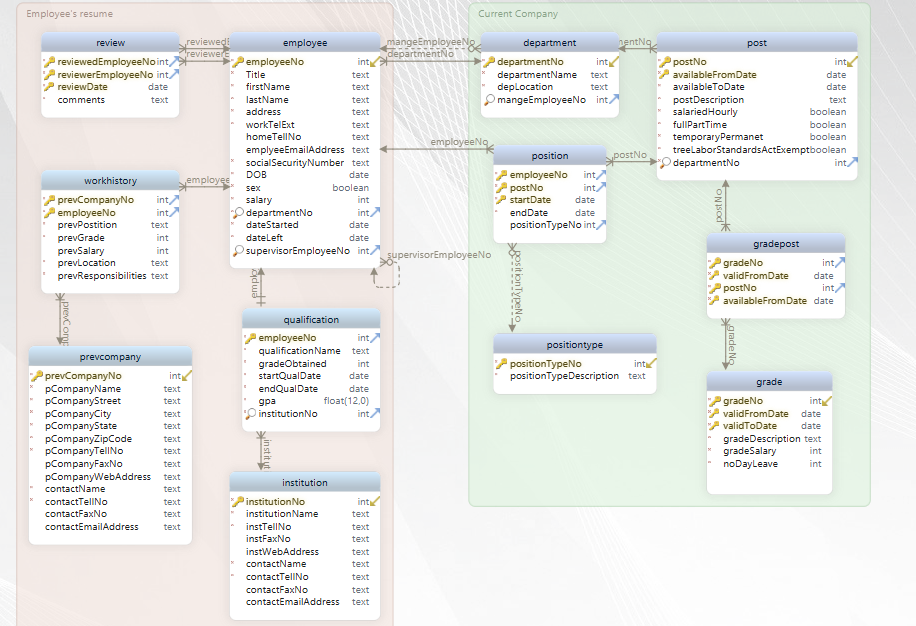
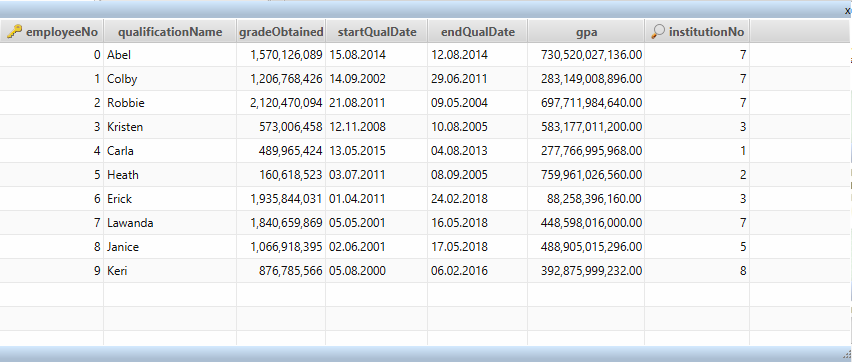
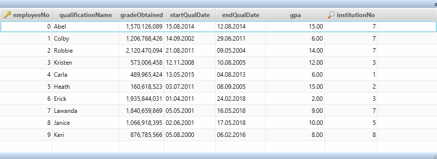
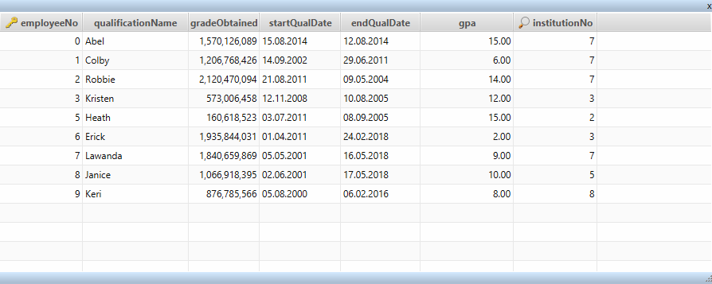
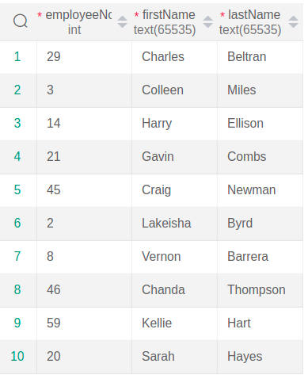
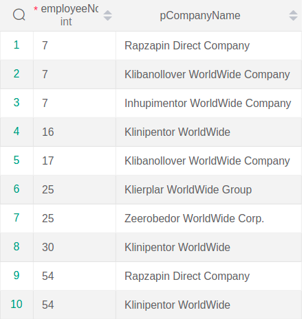
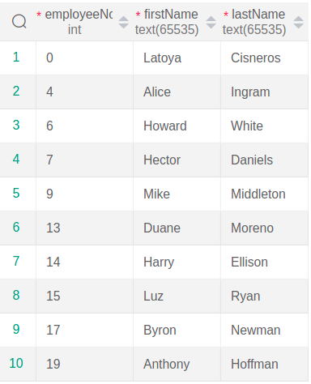
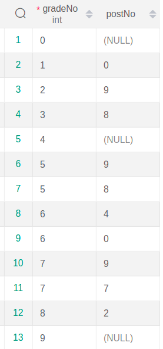
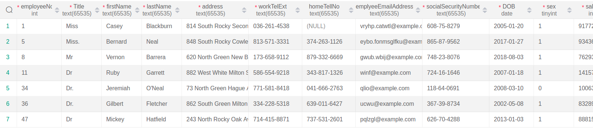
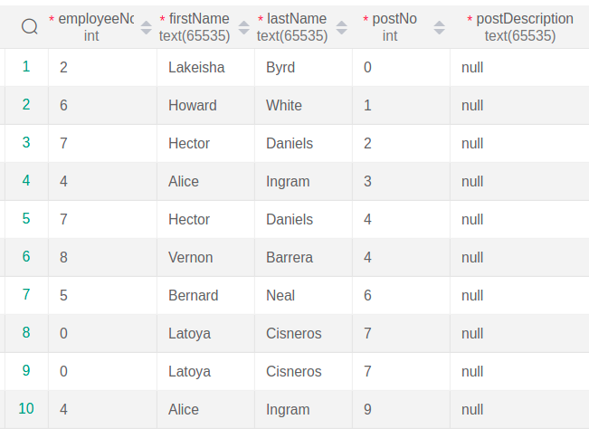

# Database Project
**we established our database on sql file(created tables, integrity constraint, forigne keies, ...) named "project.sql" and inserted 
the data we needed into "data-insertion".</br>
so our relational schema is gonna be like:</br>**



**and also ER model will be like:</br>**  

**now we want to perform some queries using select, delete, update, aggregation functions, nested, exist, comparison and membership, types of join, view and 
grant statementds.**

## Initial Tables

### Grade
``` sql
CREATE TABLE grade ( 
	gradeNo              int  NOT NULL    ,
	validFromDate        date  NOT NULL    ,
	validToDate          date  NOT NULL    ,
	gradeDescription     text  NOT NULL    ,
	gradeSalary          int  NOT NULL    ,
	noDayLeave           int  NOT NULL    ,
	positionTypeNo       int  NOT NULL    ,
	CONSTRAINT pk_grade PRIMARY KEY ( gradeNo, validFromDate, validToDate ),
	CONSTRAINT unq_grade_gradeno UNIQUE ( gradeNo ) 
 );

 CREATE INDEX fk_grade_positiontype ON grade ( positionTypeNo );

ALTER TABLE gradepost ADD FOREIGN KEY ( gradeNo ) REFERENCES grade( gradeNo ) ON DELETE RESTRICT ON UPDATE RESTRICT;
```
### Institution
``` sql
CREATE TABLE institution ( 
    institutionNo        int  NOT NULL    PRIMARY KEY,
    institutionName      text  NOT NULL    ,
    instTellNo           text  NOT NULL    ,
    instFaxNo            text      ,
    instWebAddress       text      ,
    contactName          text  NOT NULL    ,
    contactTellNo        text  NOT NULL    ,
    contactFaxNo         text      ,
    contactEmailAddress  text      
);

ALTER TABLE qualification ADD FOREIGN KEY ( institutionNo ) REFERENCES institution( institutionNo ) ON DELETE RESTRICT ON UPDATE RESTRICT;
```
### PositionType
``` sql
CREATE TABLE positiontype ( 
	positionTypeNo       int  NOT NULL    PRIMARY KEY,
	positionTypeDescription text  NOT NULL    
 );

ALTER TABLE position ADD FOREIGN KEY ( positionTypeNo ) REFERENCES positiontype( positionTypeNo ) ON DELETE NO ACTION ON UPDATE NO ACTION;
```
### PrevComapny
``` sql
CREATE TABLE prevcompany ( 
	prevCompanyNo        int  NOT NULL    PRIMARY KEY,
	pCompanyName         text  NOT NULL    ,
	pCompanyStreet       text  NOT NULL    ,
	pCompanyCity         text  NOT NULL    ,
	pCompanyState        text  NOT NULL    ,
	pCompanyZipCode      text  NOT NULL    ,
	pCompanyTellNo       text  NOT NULL    ,
	pCompanyFaxNo        text      ,
	pCompanyWebAddress   text      ,
	contactName          text  NOT NULL    ,
	contactTellNo        text  NOT NULL    ,
	contactFaxNo         text      ,
	contactEmailAddress  text      
 );

ALTER TABLE workhistory ADD FOREIGN KEY ( prevCompanyNo ) REFERENCES prevcompany( prevCompanyNo ) ON DELETE RESTRICT ON UPDATE RESTRICT;
```
### Department
``` sql
CREATE TABLE department ( 
	departmentNo         int  NOT NULL    PRIMARY KEY,
	departmentName       text  NOT NULL    ,
	depLocation          text  NOT NULL    ,
	mangeEmployeeNo      int      
 );

CREATE INDEX mangeEmployeeNo ON department ( mangeEmployeeNo );

ALTER TABLE employee ADD FOREIGN KEY ( departmentNo ) REFERENCES department( departmentNo ) ON DELETE RESTRICT ON UPDATE RESTRICT;

ALTER TABLE post ADD FOREIGN KEY ( departmentNo ) REFERENCES department( departmentNo ) ON DELETE RESTRICT ON UPDATE RESTRICT;
```
### Employee
``` sql
CREATE TABLE employee ( 
	employeeNo           int  NOT NULL    PRIMARY KEY,
	Title                text  NOT NULL    ,
	firstName            text  NOT NULL    ,
	lastName             text  NOT NULL    ,
	address              text  NOT NULL    ,
	workTelExt           text  NOT NULL    ,
	homeTellNo           text      ,
	emplyeeEmailAddress  text      ,
	socialSecurityNumber text  NOT NULL    ,
	DOB                  date  NOT NULL    ,
	sex                  boolean  NOT NULL    ,
	salary               int  NOT NULL    ,
	departmentNo         int  NOT NULL    ,
	dateStarted          date  NOT NULL    ,
	dateLeft             date  NOT NULL    ,
	supervisorEmployeeNo int      
 );

CREATE INDEX departmentNo ON employee ( departmentNo );

CREATE INDEX fk_employee_employee ON employee ( supervisorEmployeeNo );

ALTER TABLE department ADD FOREIGN KEY ( mangeEmployeeNo ) REFERENCES employee( employeeNo ) ON DELETE RESTRICT ON UPDATE RESTRICT;

ALTER TABLE employee ADD FOREIGN KEY ( supervisorEmployeeNo ) REFERENCES employee( employeeNo ) ON DELETE RESTRICT ON UPDATE RESTRICT;

ALTER TABLE position ADD FOREIGN KEY ( employeeNo ) REFERENCES employee( employeeNo ) ON DELETE RESTRICT ON UPDATE RESTRICT;

ALTER TABLE qualification ADD FOREIGN KEY ( employeeNo ) REFERENCES employee( employeeNo ) ON DELETE RESTRICT ON UPDATE RESTRICT;

ALTER TABLE review ADD FOREIGN KEY ( reviewedEmployeeNo ) REFERENCES employee( employeeNo ) ON DELETE RESTRICT ON UPDATE RESTRICT;

ALTER TABLE review ADD FOREIGN KEY ( reviewerEmployeeNo ) REFERENCES employee( employeeNo ) ON DELETE RESTRICT ON UPDATE RESTRICT;

ALTER TABLE workhistory ADD FOREIGN KEY ( employeeNo ) REFERENCES employee( employeeNo ) ON DELETE RESTRICT ON UPDATE RESTRICT;
```
### GradePost
``` sql
CREATE TABLE gradepost ( 
	gradeNo              int  NOT NULL    ,
	validFromDate        date  NOT NULL    ,
	postNo               int  NOT NULL    ,
	availableFromDate    date  NOT NULL    ,
	CONSTRAINT pk_gradepost PRIMARY KEY ( gradeNo, validFromDate, postNo, availableFromDate )
 );

CREATE INDEX fk_gradepost_post ON gradepost ( postNo );
```
### Position
``` sql
CREATE TABLE position ( 
	employeeNo           int  NOT NULL    ,
	postNo               int  NOT NULL    ,
	startDate            date  NOT NULL    ,
	endDate              date  NOT NULL    ,
	positionTypeNo       int      ,
	CONSTRAINT pk_position PRIMARY KEY ( employeeNo, postNo, startDate )
 );

CREATE INDEX employeeNo ON position ( employeeNo, postNo );

CREATE INDEX postNo ON position ( postNo );

CREATE INDEX fk_position_positiontype ON position ( positionTypeNo );
```
### Post
``` sql
CREATE TABLE post ( 
	postNo               int  NOT NULL    ,
	availableFromDate    date  NOT NULL    ,
	availableToDate      date  NOT NULL    ,
	postDescription      text  NOT NULL    ,
	salariedHourly       boolean  NOT NULL    ,
	fullPartTime         boolean  NOT NULL    ,
	temporaryPermanet    boolean  NOT NULL    ,
	treeLaborStandardsActExempt boolean  NOT NULL    ,
	departmentNo         int  NOT NULL    ,
	CONSTRAINT pk_post PRIMARY KEY ( postNo, availableFromDate ),
	CONSTRAINT postNo UNIQUE ( postNo ) 
 );

CREATE INDEX departmentNo ON post ( departmentNo );

ALTER TABLE gradepost ADD FOREIGN KEY ( postNo ) REFERENCES post( postNo ) ON DELETE RESTRICT ON UPDATE RESTRICT;

ALTER TABLE position ADD FOREIGN KEY ( postNo ) REFERENCES post( postNo ) ON DELETE RESTRICT ON UPDATE RESTRICT;
```
### Qualification
``` sql
CREATE TABLE qualification ( 
	employeeNo           int  NOT NULL    PRIMARY KEY,
	qualificationName    text  NOT NULL    ,
	gradeObtained        int  NOT NULL    ,
	startQualDate        date  NOT NULL    ,
	endQualDate          date  NOT NULL    ,
	gpa                  float(12,0)  NOT NULL    ,
	institutionNo        int  NOT NULL    
 );

CREATE INDEX institutionNo ON qualification ( institutionNo );
```
### Review
``` sql
CREATE TABLE review ( 
	reviewedEmployeeNo   int  NOT NULL    ,
	reviewerEmployeeNo   int  NOT NULL    ,
	reviewDate           date  NOT NULL    ,
	comments             text  NOT NULL    ,
	CONSTRAINT pk_review PRIMARY KEY ( reviewedEmployeeNo, reviewerEmployeeNo, reviewDate )
 );

CREATE INDEX reviewedEmployeeNo ON review ( reviewedEmployeeNo, reviewerEmployeeNo );

CREATE INDEX reviewerEmployeeNo ON review ( reviewerEmployeeNo );
```
### WorkHistory
``` sql
CREATE TABLE workhistory ( 
	prevCompanyNo        int  NOT NULL    ,
	employeeNo           int  NOT NULL    ,
	prevPostition        text  NOT NULL    ,
	prevGrade            int  NOT NULL    ,
	prevSalary           int      ,
	prevLocation         text  NOT NULL    ,
	prevResponsibilities text  NOT NULL    ,
	CONSTRAINT pk_workhistory PRIMARY KEY ( prevCompanyNo, employeeNo )
 );

CREATE INDEX fk_workhistory_employee ON workhistory ( employeeNo );
```
## Queries
consider this relation instance on qualification:



as you can see, the gpa scale is too large and covers the range of 1 billion to 1000 billion, thus if we divide it to 50 billion,
it's range will be from 1 to 20, wich is more formal.

``` sql
        UPDATE qualification
        SET gpa = gpa / 50000000000
```



now assume that we want delete employee number 4 from this table, therfore:

``` sql
        DELETE FROM qualification
        WHERE employeeNo = 4
```



1. Info on employees whose salary is above salary average

    ``` sql
        SELECT employeeNo, firstName, lastName
        FROM employee 
        WHERE salary > ( 
            SELECT avg(salary)
            FROM employee
        );
    ```

    

2. List of employees number and previous companies in which employees of department number 6 have worked in

    ``` sql
        SELECT employeeNo, pCompanyName
        FROM ( employee INNER JOIN workhistory USING(employeeNo) ) INNER JOIN prevcompany USING(prevCompanyNo)
        WHERE departmentNo = 6;
    ```

    


3. Info on female employees whose salary is more than at least 1 male employee

    ``` sql
        SELECT employeeNo , firstName, lastName 
        FROM employee e1
        WHERE e1.sex=0 AND e1.salary > SOME ( 
            SELECT salary 
            FROM employee e2
            WHERE e2.sex = 1
        );
    ```

    

4. Info on employees who have worked both in "Rapzapin Direct Comapny" and "Klibanollover WorldWide Company" companies

    ``` sql
        with emp_work_prev(employeeNo, firstName, lastName, pCompanyName) AS (
            SELECT employeeNo, firstName, lastName, pCompanyName
            FROM employee INNER JOIN (workhistory INNER JOIN prevcompany USING(prevCompanyNo)) USING(employeeNo)
        )
        SELECT employeeNo, firstName, lastName
        FROM emp_work_prev e1
        WHERE e1.pCompanyName='Rapzapin Direct Company' AND EXISTS (
            SELECT *
            FROM emp_work_prev e2
            WHERE e1.employeeNo = e2.employeeNo AND e2.pCompanyName='Klibanollover WorldWide Company');


    ```

    

5. Existing post numbers at all grades in the database

    ``` sql
        SELECT gradeNo, postNo
        FROM grade LEFT OUTER JOIN gradepost USING(gradeNo);
    ```

    


6. Consider you need to permit a secretary in the department 'Abel', access on reading user information. But you only want to give her permission in her own division

    ``` sql

        CREATE VIEW Abel_employees AS ( 
        SELECT e.* 
        FROM employee e NATURAL JOIN department
        WHERE departmentName='Abel'
        );
    ```

    

   Now if this secretary has a username called 'emmy', we wanna establish:
	
    ``` sql

        GRANT SELECT on Abel_employees to (emmy);
    ```

7. What post each employee has, is a useful query; so we create a view of each employee's info and working post

    ``` sql
        CREATE VIEW employee_post AS (
            SELECT employeeNo, firstName, lastName, postNo, postDescription
            FROM (employee NATURAL JOIN position) INNER JOIN post USING(postNo)
        );
    ```

    

8. Suppose a secretary with the username Monika is in charge of submitting interview records, so she must be granted access on creating records regarding reviews

    ``` sql
        GRANT INSERT ON review TO (monika);
    ```