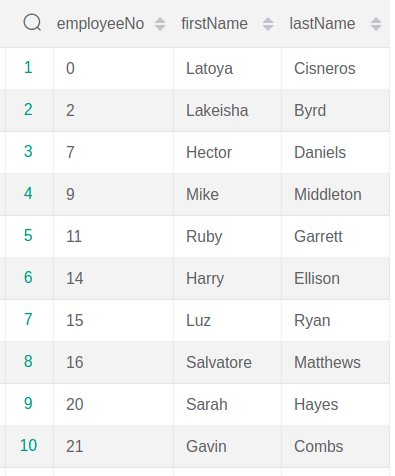

# Database Project
**we established our database on sql file(created tables, integrity constraint, forigne keies, ...) named "project.sql" and inserted 
the data we needed into "data-insertion".</br>
so our relational schema is gonna be like:</br>**


**and also ER model will be like:</br>**  

**now we want to perform some queries using select, delete, update, aggregation functions, nested, exist, comparison and membership, types of join, view and 
grant statementds.**

## Queries
consider this relation instance on qualification:


as you can see, the gpa scale is too large and covers the range of 1 billion to 1000 billion, thus if we divide it to 50 billion,
it's range will be from 1 to 20, wich is more formal.

``` sql
        UPDATE qualification
        SET gpa = gpa / 50000000000
```


now assume that we want delete employee number 4 from this table, therfore:

``` sql
        DELETE FROM qualification
        WHERE employeeNo = 4
```


1. Info on employees whose salary is above salary average

    ``` sql
        SELECT employeeNo, firstName, lastName
        FROM employee 
        WHERE salary > ( 
            SELECT avg(salary)
            FROM employee
        );
    ```

    

2. List of employees number and previous companies in which employees of department number 6 have worked in

    ``` sql
        SELECT employeeNo, pCompanyName
        FROM ( employee INNER JOIN workhistory USING(employeeNo) ) INNER JOIN prevcompany USING(prevCompanyNo)
        WHERE departmentNo = 6;
    ```

    


3. Info on female employees whose salary is more than at least 1 male employee

    ``` sql
        SELECT employeeNo , firstName, lastName 
        FROM employee e1
        WHERE e1.sex=0 AND e1.salary > SOME ( 
            SELECT salary 
            FROM employee e2
            WHERE e2.sex = 1
        );
    ```

    

4. Info on employees who have worked both in "Rapzapin Direct Comapny" and "Klibanollover WorldWide Company" companies

    ``` sql
        with emp_work_prev(employeeNo, firstName, lastName, pCompanyName) AS (
            SELECT employeeNo, firstName, lastName, pCompanyName
            FROM employee INNER JOIN (workhistory INNER JOIN prevcompany USING(prevCompanyNo)) USING(employeeNo)
        )
        SELECT employeeNo, firstName, lastName
        FROM emp_work_prev e1
        WHERE e1.pCompanyName='Rapzapin Direct Company' AND EXISTS (
            SELECT *
            FROM emp_work_prev e2
            WHERE e1.employeeNo = e2.employeeNo AND e2.pCompanyName='Klibanollover WorldWide Company');


    ```

    

5. Existing post numbers at all grades in the database

    ``` sql
        SELECT gradeNo, postNo
        FROM grade LEFT OUTER JOIN gradepost USING(gradeNo);
    ```

    


6. Consider you need to permit a secretary in the department 'Abel', access on reading user information. But you only want to give her permission in her own division

    ``` sql

        CREATE VIEW Abel_employees AS ( 
        SELECT e.* 
        FROM employee e NATURAL JOIN department
        WHERE departmentName='Abel'
        );
    ```

    

   Now if this secretary has a username called 'emmy', we wanna establish:
	
    ``` sql

        GRANT SELECT on Abel_employees to (emmy);
    ```

7. What post each employee has, is a useful query; so we create a view of each employee's info and working post

    ``` sql
        CREATE VIEW employee_post AS (
            SELECT employeeNo, firstName, lastName, postNo, postDescription
            FROM (employee NATURAL JOIN position) INNER JOIN post USING(postNo)
        );
    ```

    

8. Suppose a secretary with the username Monika is in charge of submitting interview records, so she must be granted access on creating records regarding reviews

    ``` sql
        GRANT INSERT ON review TO (monika);
    ```